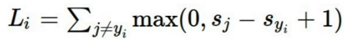
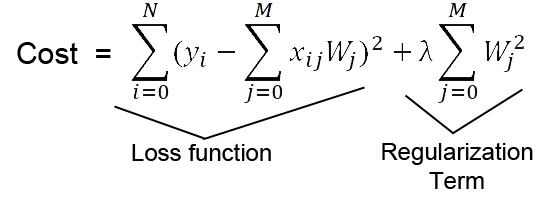
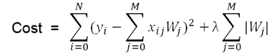

Image Classifiacation
======================
### classifiacton 발전
1. 다양한 동물을 인식하기 위한 일종의 고급 코드 규칙을 작성하기 위해 명시적인 시도를 해왔음   
but! 부서지기 쉬움, 확장성이 뛰어나지 않음   

2. KNN(K-Nearest Neighbor)   
* simple image classifier   
* 훈련단계에서는 아무것도 하지 않고 모든 훈련 데이터를 기억  
* 예측 단계에서는 새로운 이미지를 가져와 앞서 훈련단계에서 보았던 데이터 중 가장 유사한 이미지를 찾아 그 이미지의 라벨로 예측
* Distance Metric: Manhattan, Euclidean
* drawback: 시간이 오래걸림, 이미지간의 지각적 유사성 거리와 픽셀가늬 거리가 다름, 차원의 저주   
   

3. Linear Classification
* 매우 간단한 학습 알고리즘, NN을 구축하는데 많이 사용됨
* 딥러닝에서 가장 기본적인 구성 요소
* 가중치 행렬과 이미지 행렬의 계산으로 템플릿과 이미지 픽셀 사이의 유사성에 대한 Score을 매김
* 선현 분류기를 하나만 이용하면 템플릿이 하나로만 요약됨. 따라서 다양한 블록을 쌓아야 함

4. Multiclass SVM Loss  
* SVM = Support Vector Machine   
* wants the score of the correct class to be higher than all other scores by at least a margin of delta
* 정답이 아닌 class는 delta만큼의 오차를 가지고 정답인 class보다 점수가 낮아야 함
  = 정답인 class는 정답이 아닌 class보다 delta 이상으로 점수가 높아야 함   

 5. Regularization  
 * loss function 뒤에 항을 추가하여 함수를 simple하게 만듦
 * L2 Regularization  
   * 매끄러운 그래프를 원할떄 쓰는 정규화  
   *  특덩 요소의 의존보다는 모든 요소의 전체적인 영향을 원하는 정규화
   

* L1 Regularization
  * 분류기가 복잡하다고 느껴질 떄 쓰는 정규화
  * 가중치 값에 0이 많도록 하여 보다 더 단순한 식을 만들어줌  
  